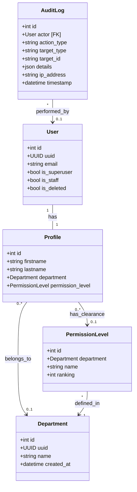

# Admin Page — Aligned Feature Prompt

## Overview
- **Goal:** Add a dedicated Admin UI integrated directly within the existing Next.js frontend (`frontend/app/admin/`), utilizing the `management` Django service's administrative backend APIs. This supports initial site configuration and ongoing administration.
- **Minimalist Schema Design:** To align perfectly with the existing Mandatory Access Control (MAC) architecture and avoid redundant databases, this feature will **completely reuse** the existing `User`, `Profile`, `Department`, and `PermissionLevel` models. Since this is an archive system where users do not edit documents, granular action-based permissions (e.g. `drive:write`, `chat:create`) are not needed. Access is purely hierarchical based on a user's Clearance (Permission) Level. Thus, **no new fields are required on the existing models**, and we will introduce only **one new database model** (`AuditLog`).

---

## Primary Responsibilities
1. **Manage Departments:** Create, read, update, and delete (CRUD) departments using the existing `Department` model.
2. **Manage Clearance (Permission) Levels:** Create, read, update, and delete (CRUD) levels per department using the existing `PermissionLevel` model (which stores names like "Secret" and hierarchy `ranking`).
3. **Assign Users to Departments & Clearance Levels:** Manage user placements directly via the existing `Profile` model's `department` and `permission_level` relationships.
4. **Designate Site Administrators:** Promote or demote users to/from global site admins using the built-in `is_superuser` and `is_staff` flags on the existing `User` model.
5. **Audit Administrative Changes:** Log all admin operations in a dedicated `AuditLog` table for tamper-evident history.

---

## Codebase Model Mapping & Schema Adjustments

To satisfy all user administration and clearance management requirements, the existing schema in `/management/UserAccountManager/models.py` will be leveraged as follows:

### 1. User & Admin Model (Existing)
*   **Source:** `User` model in `UserAccountManager/models.py`.
*   **Usage:** Reuse as-is. Site admins are designated by `is_superuser = True` (or `is_staff = True`).
*   **No new models or custom admin flags are required.**

### 2. Department Model (Existing)
*   **Source:** `Department` model in `UserAccountManager/models.py`.
*   **Usage:** Reuse as-is (contains `id`, `uuid`, `name`, `created_at`, `updated_at`).
*   **Optional Addition:** We can optionally add a `description` field (`models.TextField(blank=True, null=True)`) if user UI descriptions are desired.

### 3. Clearance / Permission Level Model (Existing)
*   **Source:** `PermissionLevel` model in `UserAccountManager/models.py`.
*   **Usage:** Reuse to represent hierarchical department clearances. The existing `ranking` field (integer) naturally represents the clearance hierarchy where higher values inherit access to lower-ranked resources.
*   **No new fields are required on this model.**

### 4. Department Membership & Assignment (Existing)
*   **Source:** `Profile` model in `UserAccountManager/models.py`.
*   **Usage:** Fully reuse the existing `Profile.department` and `Profile.permission_level` relationships! 
*   **Benefit:** This completely avoids creating a redundant `DepartmentMembership` table. Since SimpleJWT token generation (`CustomTokenObtainPairSerializer`) is already hardwired to read department and ranking directly from the `Profile` model, managing assignments here ensures downstream services (such as RAG Elasticsearch filters and MinIO access rules) immediately recognize the updates.

### 5. Audit Log Model [ONLY NEW MODEL]
*   **Source:** Create `AuditLog` in `UserAccountManager/models.py`.
*   **Fields:**
    *   `id` (AutoField or UUIDField)
    *   `actor` (ForeignKey to `User`, on_delete=models.SET_NULL, null=True, related_name='admin_actions')
    *   `action_type` (CharField, e.g. `"CREATE"`, `"UPDATE"`, `"DELETE"`, `"ASSIGN"`, `"ROLE_TOGGLE"`)
    *   `target_type` (CharField, e.g. `"DEPARTMENT"`, `"PERMISSION_LEVEL"`, `"USER"`)
    *   `target_id` (CharField, stores the UUID or primary key of the modified object)
    *   `details` (JSONField, stores details such as prior/post value differences or descriptions of the change)
    *   `ip_address` (GenericIPAddressField, null=True, blank=True)
    *   `timestamp` (DateTimeField, auto_now_add=True)

---

## Core Requirements & Deliverables

### Backend: Admin APIs (`/management/`)
Implement RESTful JSON administrative endpoints inside the `UserAccountManager` app under a secure path `/auth/admin/`:
1.  **Auth & Security:** Protect all `/auth/admin/` routes with a new permission class `IsSiteAdmin` (checks `request.user.is_authenticated and request.user.is_superuser`).
2.  **Departments:**
    *   `GET /auth/admin/departments/` - List all departments.
    *   `POST /auth/admin/departments/` - Create a department (optionally accepts a list of default permission levels to create in a single database transaction).
    *   `GET /auth/admin/departments/<int:id>/` - Retrieve department details.
    *   `PUT/PATCH /auth/admin/departments/<int:id>/` - Update a department (e.g., rename, update description).
    *   `DELETE /auth/auth/departments/<int:id>/` - Delete a department. *Must perform integrity checks to ensure no users or active files are linked before allowing deletion.*
3.  **Clearance Levels (per Department):**
    *   `GET /auth/admin/departments/<int:dept_id>/permission-levels/` - List levels for a department.
    *   `POST /auth/admin/departments/<int:dept_id>/permission-levels/` - Create a new clearance level (ensures `ranking` is unique within that department).
    *   `PUT/PATCH /auth/admin/permission-levels/<int:id>/` - Edit level details (name, ranking).
    *   `DELETE /auth/admin/permission-levels/<int:id>/` - Delete a level. *Must guard against deleting levels currently assigned to active user profiles.*
4.  **User Management:**
    *   `GET /auth/admin/users/` - Search and list users with nested profiles (paginated; filter by search query or department).
    *   `POST /auth/admin/users/<int:user_id>/assign/` - Assign user to a department and clearance/permission level (updates the user's `Profile` fields transactionally).
    *   `POST /auth/admin/users/<int:user_id>/toggle-admin/` - Promote or demote a user to site admin (`is_superuser` and `is_staff`).
5.  **Audit Logs:**
    *   `GET /auth/admin/audit-logs/` - Paginated administrative audit logs.

---

### Frontend: Integrated Admin UI (`/frontend/`)
Instead of a separate repository, implement the Admin UI inside the existing Next.js frontend at `frontend/app/admin/` to leverage existing styling, state, and authentication mechanisms:
1.  **Admin Layout (`frontend/app/admin/layout.tsx`):**
    *   Implements an elegant sidebar navigation tailored for administrators (Dashboard, Departments, Users, Audit Logs).
    *   Enforces a client-side and server-side route guard: Checks if `user.is_superuser` is true. If not, redirects to `/login` or presents an elegant 403 Access Denied page.
2.  **Dashboard (`frontend/app/admin/page.tsx`):**
    *   A high-end admin control center containing quick KPI stats (Total Users, Active Departments, Level Distribution) and a feed of the 5 most recent audit log actions.
3.  **Department Management (`frontend/app/admin/departments/page.tsx`):**
    *   A grid/list view showing all departments, member counts, and configured clearance tiers.
    *   Interactive modal forms to create/edit departments and add nested permission levels dynamically.
4.  **User Assignments (`frontend/app/admin/users/page.tsx`):**
    *   A searchable user registry table showcasing department assignments, clearance levels, and site administrator status.
    *   Slide-over panel to edit a user: select their department, assign their clearance level (fetched dynamically based on the chosen department), and toggle superuser status.
5.  **Audit Log Viewer (`frontend/app/admin/audit-logs/page.tsx`):**
    *   A clean data table displaying audit events (Actor, Action Type, Target, IP Address, Timestamp, Diff Details).
    *   Supports quick filtering by Actor, Target Type, and Action Type.

---

## Technical Considerations & Security
- **Atomic Operations:** Endpoints that modify clearance levels or user assignments must be atomic (wrapped in `transaction.atomic()`) to prevent broken configurations.
- **Audit Logging Decorators / Middleware:** Implement a helper or decorator to record administrative actions automatically upon successful completion of admin endpoints.
- **JWT Integrity:** Since access levels are encoded inside SimpleJWT claims, changing a user's department or clearance will reflect as soon as their token refreshes or upon next login. A mechanism to invalidate old admin/user sessions (or force token refreshes) is highly recommended for high-impact changes.
- **Principle of Least Privilege:** Do not expose user password hashes or sensitive OAuth secret keys through the admin API endpoints.

---

## Next Steps
1.  **Database Migration:** Create the `AuditLog` model in `UserAccountManager`. (No migrations or changes are needed for existing models, as the current attributes align perfectly with the requirement).
2.  **API Implementation:** Build the `/auth/admin/` endpoints in the `management` service and secure them using JWT-based admin authentication.
3.  **Next.js Page Scaffolding:** Create `frontend/app/admin/` route group, implement the side-nav layout and admin middleware guard.
4.  **UI Component Building:** Construct pages for Dashboard, Departments, Users, and Audit Logs using Tailwind CSS, Radix UI components, and Lucide React.
